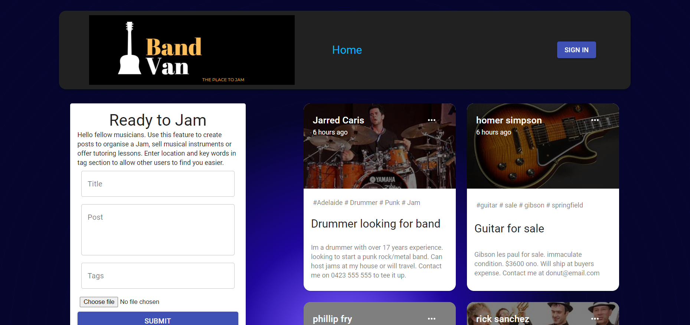

# BandVan_2.0
Starting my project again using some seperate files from my first attempt with new code i have been practicing

  ## Description
  A full stack web app using mongo, express, react and node.js

  * [Installation](#installation)
  * [Technology](#technology)
  * [Success](#success)
  * [Holdbacks](#holdbacks)
  * [Contribution](#contribution)
  * [Test](#test)
  * [License](#license)
  * [Questions](#questions)
  

## Installation
none

## Technology
React, Express, MongoDB, node.js, material UI, redux, Auth0, mongoose  

## Success
This was the big one. This app was a real test of everything we had learnt over the last 6 months. The form creation and getting the posts to go where needed was, while difficult, easier to overcome. i am happy with the layout and the look of it as well as its functionality. Material UI took a little while to understand but i found it to be a robust data base with alot of options for customization. 

## Holdbacks
Many. Auth0 was a whole new experience and, while easy in a log in sense, required a considerable amount of work to make sure it was passed through to all the areas that it needed to be called. Redux was also a fairly new idea which i chose as my workplace uses it and would help me slide into a developer role knowing the basics. This may not have been the best option as it did create a great deal more work for me. But my biggest holdback by far is the same one i have always had and that is making sure to use proper punctuation. Capital letters or a missing closing tag has been a problem of mine and added many hours to not only this but all my projects. It is something i will be working on for my future work.

## Contribution
This was written completely from scratch. We were given examples of a mern skeleton app as a building block but from there, everything needed to be built from the ground up. 

## Test
no testing 

## License 

## Questions
If you have fursther questions, you can reach me at
[Github](https://github.com/Jarred-Caris)
or
jarred.caris@gmail.com

[click for URL] (https://bandvan2.netlify.app/)
[click for URL] (https://bandvan.herokuapp.com/posts)
[click for URL] (https://github.com/Jarred-Caris/BandVan_2.0)